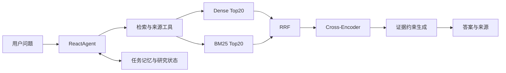

# 自动驾驶感知算法 LocalRAG

LocalRAG 是一个面向自动驾驶感知算法资料的 Agentic RAG 系统。它将混合检索、来源核验、任务记忆和可恢复研究流程组合在一个 Streamlit 应用中，并支持云端模型、本地模型服务和长会话压缩。

## 工作原理

一次问答由 `ReactAgent` 负责选择工具。检索工具从 Chroma 中分别执行 Dense 和 BM25 召回，通过 RRF 合并排名，再由 Cross-Encoder 精排；最终答案只使用检索到的证据，并保留来源、定位和各阶段排名。研究任务、会话摘要和任务记忆独立持久化，页面刷新后仍可继续。



## 快速开始

### 1. 安装依赖

```bash
pip install -r requirements.txt
```

### 2. 配置运行时

复制示例配置并填写真实值：

```bash
cp config/runtime_models.example.json config/runtime_models.json
```

```json
{
  "provider": "modelscope",
  "api_key": "your-api-key",
  "base_url": "https://api-inference.modelscope.cn/v1",
  "chat_model_name": "Qwen/Qwen2.5-72B-Instruct",
  "embedding_model_name": "Qwen/Qwen3-Embedding-8B"
}
```

本地模型服务使用独立的示例配置和部署 profile：

```powershell
Copy-Item config/runtime_v1_6_local_service.example.json config/runtime_v1_6_local_service.json
Copy-Item config/model_serving_profiles.example.json config/model_serving_profiles.json
```

默认配置使用云端模型。外层 Planner 始终读取运行时配置中的聊天模型；本地 Gateway 只接管 RAG 生成和长上下文摘要，并在本地服务不可用时按配置降级到云端。

运行时配置支持 `model_route_mode`：`auto` 按配置启用本地并允许云端降级，`local` 手动选择本地优先路径（失败仍可降级云端），`cloud` 手动选择云端并关闭本地 Gateway。`local_model_gateway` 下的 `rag_generation_enabled` 和 `conversation_summary_enabled` 仍是对应功能的安全开关。UI 侧边栏可直接切换该模式，切换后会重建 Agent；该选项不改变外层 Planner 的模型。

默认 `runtime_models.json` 未配置 `local_model_gateway`，因此 UI 显示本地服务未启用是正常状态。要启用本地 Gateway，需要显式切换运行时配置；仅复制文件不会自动切换：

```powershell
Copy-Item config/runtime_v1_6_local_service.example.json config/runtime_v1_6_local_service.json
$env:LOCALRAG_RUNTIME_CONFIG = "config/runtime_v1_6_local_service.json"
$env:LOCALRAG_MODEL_API_TOKEN = "your-local-service-token"
# 可选：在配置 JSON 中设置 "model_route_mode": "local"
streamlit run app_qa.py --server.fileWatcherType none
```

例如使用本地 Q4_K_M Gateway 时，可先启动内部 llama.cpp 服务，再启动本项目的 OpenAI-compatible 服务：

```powershell
python -m model_serving.main --profiles config/model_serving_profiles.json --profile e6_1_q4_k_m --port 8002 --llama-base-url http://127.0.0.1:18002/v1
```

本地 Gateway 默认地址为 `http://127.0.0.1:8002/v1`。`local` 和 `auto` 模式需要先启动该服务；`cloud` 模式直接使用云端模型。无论选择哪种模式，长上下文压缩都保持启用。

### 3. 启动问答服务

```bash
streamlit run app_qa.py
```

默认读取 `config/active_corpus.json`，加载 100-source / 7339-chunk Chroma store。active corpus profile 同时记录来源数、片段数和 corpus/registry 指纹。大型 Chroma 数据不随 Git 分发；新环境需要先生成 store，或通过环境变量选择已有目录：

```powershell
$env:LOCALRAG_PERSIST_DIRECTORY = "path\to\chroma_store"
streamlit run app_qa.py
```

UI 会检查 active corpus profile、最近一次 Agent Gate 的 corpus/代码身份和最近三轮评测的稳定性 Gate。任一身份不一致、artifact 损坏或出现递归上限错误时，Gate 均显示为未通过。

### 4. 上传文档入库

```bash
streamlit run app_file_uploader.py
```

## 项目结构

```
LocalRAG/
├── app_qa.py                  # 问答入口（Streamlit）
├── app_file_uploader.py       # 文件上传入库入口
├── agent/
│   ├── react_agent.py         # Session-aware Agent 入口
│   ├── observability.py       # 工具轨迹、来源、记忆与 gate 可观察性
│   ├── context/               # 上下文预算、摘要压缩、持久化与恢复
│   ├── memory/                # Agent 会话检索记忆与持久化任务记忆
│   ├── research/              # 研究 run、恢复控制、证据绑定与 UI 适配
│   └── tools/                 # RAG、来源研究与任务记忆工具
├── core/
│   ├── rag.py                 # RAG 服务核心
│   ├── knowledge_base.py      # 知识库入库与 chunk 写入
│   ├── chunking.py            # 分块策略（baseline / doc_type_aware / semantic）
│   ├── bm25_retriever.py      # BM25 稀疏召回
│   ├── retrieval_pipeline.py  # Dense + BM25 → RRF → Reranker 主链路
│   ├── hybrid_retriever.py    # 历史加权 Hybrid 对照实现
│   └── reranker.py            # Cross-Encoder Reranker
├── config/
│   ├── runtime_models.json    # 运行时配置（不提交）
│   ├── runtime_keys.py        # 配置加载器
│   └── settings.py            # 全局设置
├── eval/                      # 评测脚本
│   └── release_gate.py        # 最近三轮正式 Agent Gate 稳定性检查
├── model_gateway/              # 本地模型 gateway、熔断、fallback 与适配器
├── model_serving/              # Transformers / llama.cpp 服务端与队列指标
├── model_deployment/           # 模型合并、量化、manifest 与启动脚本
├── data/
│   ├── evaluation/            # 清洗后的评测/训练数据集
│   └── sources/               # 知识源文档（100 篇：10 Apollo + 81 论文/报告 + 9 标准）
├── results/                   # 评测结果
├── scripts/                   # 工具脚本
├── test/                      # 单元测试与评测脚本
├── release_note.md            # v1.1–v1.7 累计发布记录
└── requirements.txt           # 应用与本地模型服务的统一依赖入口
```

## 评测

### 运行评测

```bash
# Baseline 评测（使用 chunking_eval 生成的当前 store）
python eval/eval_ragas.py \
  --dataset data/evaluation/gold/eval_set.json \
  --store-dir results/chunking_eval/stores/<run_id>/baseline \
  --predictions-out results/ragas_eval/eval_set-current/predictions.json \
  --metrics-out results/ragas_eval/eval_set-current/metrics.json

# 分块策略对比（baseline / doc_type_aware / semantic）
python eval/eval_chunking.py \
  --dataset data/evaluation/gold/eval_set.json

# 纯检索评测（以 semantic store 为例）
python eval/eval_retrieval_only.py \
  --dataset data/evaluation/gold/eval_set.json \
  --store-dir results/chunking_eval/stores/<run_id>/semantic

# Hybrid Retrieval 对比
python eval/eval_hybrid.py \
  --dataset data/evaluation/gold/eval_set.json \
  --store-dir results/chunking_eval/stores/<run_id>/semantic \
  --alpha 0.5

# Reranker 效果评估
python eval/eval_reranker.py \
  --dataset data/evaluation/gold/eval_set.json \
  --store-dir results/chunking_eval/stores/<run_id>/semantic \
  --alpha 0.5

# Formal Judge 流水线汇总
python eval/eval_judge_formal_run.py \
  --dataset data/evaluation/gold/eval_set.json

# Agent 正式 Gate（默认使用 active corpus）
python eval/eval_agent.py

# 检查最近三轮 Agent Gate 的稳定性
python eval/release_gate.py

# 本地模型服务质量与可靠性评测
python eval/eval_model_quality.py
python eval/eval_service_reliability.py

# 长会话压缩评测
python eval/eval_long_context.py
```

### 微调数据与行为评测

```bash
# 将 203 条训练样本导出为 Qwen/TRL 常用 chat JSONL
python scripts/prepare_sft_dataset.py \
  --input data/evaluation/train/train_set.json \
  --train-output data/finetuning/sft_train.jsonl \
  --validation-output data/finetuning/sft_validation.jsonl \
  --validation-count 20

# 对 baseline / 微调后 predictions 做离线行为对比
python eval/eval_finetune_behavior.py \
  --baseline-predictions results/baseline_eval/<run_id>/predictions.json \
  --predictions results/finetuned_eval/<run_id>/predictions.json
```

### 检索评测结果与口径（100 题，BGE-M3，100 篇文档）

下表是 v1.2/v1.3 的分块与 Cross-Encoder 消融结果，使用历史 semantic/doc-type-aware 检索评测入口；它用于比较分块和精排收益，不等同于 v1.7 的在线默认主链路。

| 分块策略 | Reranker | Hit@5 | MRR | Hit@1 | Hit@3 |
|---------|:--------:|:-----:|:---:|:-----:|:-----:|
| baseline | No | 0.920 | 0.874 | 0.840 | 0.910 |
| baseline | Yes | 0.930 | 0.889 | 0.860 | 0.920 |
| doc_type_aware | No | 0.930 | 0.870 | 0.830 | 0.920 |
| **doc_type_aware** | **Yes** | **0.940** | 0.892 | 0.850 | **0.940** |
| semantic | No | 0.930 | 0.798 | 0.710 | 0.870 |
| **semantic** | **Yes** | **0.940** | **0.893** | **0.860** | 0.930 |

该组实验中，doc_type_aware + reranker 与 semantic + reranker 的 Hit@5 均为 0.94；semantic + reranker 的 MRR 最高，为 0.893。

Reranker 的收益主要体现在排序质量：semantic 的 MRR 从 0.798 提升到 0.893，Hit@1 从 0.71 提升到 0.86。v1.7 默认链路固定为 Dense + BM25 → RRF → Cross-Encoder → Top5；加权融合 `HybridRetriever` 作为历史对照保留，失败时降级到 Dense + reranker、Dense-only。

v1.7 最终默认链路在同一 100 题活动评测集、当前 doc-type-aware 活动语料上完成 retrieval-only 回归：Dense Top20 + BM25 Top20 → RRF → Cross-Encoder → Top5，Hit@1=0.85、Hit@3=0.97、Hit@5=0.97、MRR=0.9067，100/100 进入 `rrf_rerank` 且无 fallback；该结果不调用生成模型。由于分块索引、融合方法和评测入口同时发生变化，不能将 0.94→0.97 归因于 RRF 单项收益。

RAGAS 端到端对照中，hybrid + reranker 的 Context Precision/Recall 为 0.847/0.937；该指标评估生成上下文质量，与 retrieval-only 的 Hit@k/MRR 分属不同评测层。

### 微调、模型服务与长上下文

- 基于 LLaMA-Factory 对 Qwen3-4B 开展 4-bit QLoRA 微调，完成 LoRA 权重合并、Transformers 与 llama.cpp 双路径推理验证，并通过生成行为评测和训练退出检查确认微调目标。
- 基于 FastAPI 搭建 OpenAI-compatible 流式推理服务，支持请求排队、超时取消、API 鉴权和 Prometheus 指标；完成 BF16、GGUF F16 与 Q4_K_M 部署 profile 验证。
- 引入结构化滚动摘要和摘要 revision，长会话评测中的上下文 Token 中位数降低 73.5%。

Baseline 端到端评测使用当前 baseline store（`results/chunking_eval/stores/eval_set-20260522-071034/baseline`）重跑后，`answered_ratio=1.00`、`context_hit_ratio=1.00`、`evidence_source_hit_ratio=0.97`。

v1.6 本地模型服务与长会话验证：模型服务质量 gate、性能 benchmark、Task 8 UI 端到端验证和 Task 9 双轮压缩探针均通过；Task 9 的摘要 revision 从 `1` 正确递增到 `2`。

## 版本

| 版本 | 核心能力 |
|------|---------|
| v1.0 | Gold Set、baseline runner 和 judge 骨架 |
| v1.1 | 文档采集、chunk metadata 和 formal judge |
| v1.2 | Hybrid retrieval、reranker 和 semantic chunking |
| v1.3 | 100 篇语料、100 题评测集、Qwen3-4B 微调实验 |
| v1.4.2 | 会话记忆、任务记忆、来源工具和 Agent Gate |
| v1.5 | 执行预算、证据绑定、暂停恢复和 checkpoint |
| v1.6 | 本地模型服务、Gateway fallback 和会话压缩 |
| v1.7 | Dense + BM25 → RRF → Cross-Encoder、统一 provenance 和工具错误合同 |
