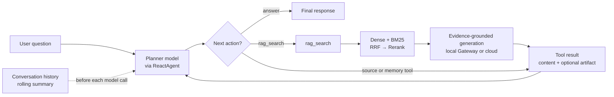

# LocalRAG for Autonomous Driving Perception

<p align="center">
  <strong>English</strong> · <a href="README.zh-CN.md">简体中文</a>
</p>

LocalRAG is an Agentic RAG system for autonomous-driving perception research. It combines hybrid retrieval, source verification, task memory, and resumable research workflows in a Streamlit application. The system supports cloud models, a local model gateway, and long-context compression.

## How it works

For each question, `ReactAgent` runs a Planner loop in which the configured chat model either calls a tool or answers directly. `rag_search` performs retrieval and RAG generation inside the tool, then returns the generated answer, sources, and trace as a `ToolMessage`. Control returns to the Planner, which can call another tool or produce the final response. Research runs, conversation summaries, and task memory are persisted separately, so a refreshed page can resume an existing task.



## Quick start

### 1. Prepare the Windows environment

The supported local path uses PowerShell, Python 3.11/3.12, an NVIDIA GPU, and a repository-level `.venv`:

```powershell
.\quickstart\windows\01-check-environment.ps1 -InstallDependencies
```

The complete sequence for downloading Qwen3-4B, building the default corpus, preparing all 203 fine-tuning records, running 4-bit QLoRA, exporting the model, starting the service, and evaluating it is documented in [quickstart/windows/README.md](quickstart/windows/README.md).

### 2. Configure model roles

Copy `config/runtime_models.example.json` to `config/runtime_models.json`. The runtime has three independently routed roles: `planner`, `rag`, and `summary`. Each role defines a cloud endpoint, a local endpoint, and a `route` set to either `local` or `cloud`.

```powershell
Copy-Item config/runtime_models.example.json config/runtime_models.json
[Environment]::SetEnvironmentVariable("LOCALRAG_CLOUD_API_KEY", "your-cloud-key", "User")
[Environment]::SetEnvironmentVariable("LOCALRAG_MODEL_API_TOKEN", "your-local-token", "User")
```

Secrets are resolved only from the environment variable names stored in JSON. For a locally routed Planner, an invocation error falls back to that role's cloud model. RAG generation and summary use the Gateway's typed fallback rules; a streaming request can switch to cloud only before the local service emits output. The three roles may share one endpoint and model, or use separate ports. Sharing a service does not mix conversations because every request carries its own messages; requests only share the model queue.

The Streamlit sidebar changes the three `route` values and writes them back to the active runtime JSON. Endpoint and model names remain JSON-managed. Route controls are disabled while a research run is active.

#### Local model service startup

For the standard Windows path, start either the repository's evaluated E6.1 adapter or an adapter produced by the full-data QLoRA configuration:

```powershell
.\quickstart\windows\06-start-service.ps1 -Profile e6_1_adapter_bf16
# or
.\quickstart\windows\06-start-service.ps1 -Profile full_sft_adapter_bf16
```

The launcher validates the selected adapter and manifest, updates the local endpoint identity in the runtime JSON, and listens on `127.0.0.1:8001`. Use [quickstart/windows/README.md](quickstart/windows/README.md) for model download, training, and evaluation commands.

The lower-level release scripts remain available for the evaluated E6.1 profiles. This path has two layers: a model backend (Transformers or `llama-server`) and the OpenAI-compatible wrapper in this repository. The example below exposes the wrapper at `127.0.0.1:8002`. Model weights, GGUF artifacts, and the `tools/llama.cpp` binaries are local artifacts and must be prepared before startup.

| Profile | Backend | Required before startup | Intended use |
|---|---|---|---|
| `e6_1_adapter_bf16` | Transformers | `models/Qwen3-4B`, the E6.1 LoRA adapter, and `e6_1_input_manifest.json` | Reproduce the evaluated adapter path; higher VRAM use |
| `e6_1_q4_k_m` | `llama.cpp` | `artifacts/models/qwen3-4b.e6.1-q4_k_m.gguf`, its manifest, and an installed `llama-server.exe` | Windows local release candidate |

Use the repository launcher from terminal A. It verifies the manifest, warms up the backend, and performs a readiness check before serving requests.

**Transformers BF16:**

```powershell
$env:LOCALRAG_MODEL_API_TOKEN = "your-local-service-token"
.\model_deployment\launch_transformers.ps1 -Port 8002
```

The launcher defaults to `e6_1_adapter_bf16` and `config/model_serving_profiles.example.json`. To maintain a separate profile file, run the service module directly:

```powershell
python -m model_serving.main `
  --profiles config/model_serving_profiles.json `
  --profile e6_1_adapter_bf16 `
  --host 127.0.0.1 `
  --port 8002 `
  --workers 1
```

**Q4_K_M: start llama.cpp and the wrapper together:**

```powershell
$env:LOCALRAG_MODEL_API_TOKEN = "your-local-service-token"
.\model_deployment\launch_llama.ps1 `
  -Mode ReleaseQ4 `
  -Model artifacts/models/qwen3-4b.e6.1-q4_k_m.gguf `
  -Manifest model_deployment/manifests/e6_1_q4_k_m_manifest.json `
  -InternalPort 18002 `
  -Port 8002
```

`launch_llama.ps1` starts `llama-server.exe` on `127.0.0.1:18002`, waits until `/v1/models` exposes `localrag-qwen3-4b-e6.1`, and then starts the repository wrapper on `127.0.0.1:8002`. llama.cpp stdout and stderr are written to `results/model_serving/llama-cpp/`. The launcher expects the llama.cpp version recorded in the manifest at `tools/llama.cpp/<version>/bin/llama-server.exe`. The installer requires an official download URL and SHA-256 value; inspect its parameters with:

```powershell
Get-Help .\model_deployment\install_llama_cpp.ps1 -Full
```

For troubleshooting, the internal server and the wrapper can be started separately. First run `llama-server` with the same arguments as the launcher:

```powershell
$env:LLAMA_ARG_CHAT_TEMPLATE_KWARGS = '{"enable_thinking":false}'
& .\tools\llama.cpp\b10256\bin\llama-server.exe `
  --model .\artifacts\models\qwen3-4b.e6.1-q4_k_m.gguf `
  --alias localrag-qwen3-4b-e6.1 `
  --host 127.0.0.1 `
  --port 18002 `
  --ctx-size 40960 `
  --jinja `
  --parallel 1 `
  --n-gpu-layers 999 `
  --temp 0
```

Then start the wrapper in another terminal:

```powershell
python -m model_serving.main `
  --profiles config/model_serving_profiles.json `
  --profile e6_1_q4_k_m `
  --host 127.0.0.1 `
  --port 8002 `
  --workers 1 `
  --llama-base-url http://127.0.0.1:18002/v1
```

Check the service from terminal B:

```powershell
Invoke-RestMethod http://127.0.0.1:8002/health
Invoke-RestMethod `
  -Headers @{Authorization = "Bearer $env:LOCALRAG_MODEL_API_TOKEN"} `
  http://127.0.0.1:8002/ready
Invoke-RestMethod `
  -Headers @{Authorization = "Bearer $env:LOCALRAG_MODEL_API_TOKEN"} `
  http://127.0.0.1:8002/v1/models
```

These endpoints answer three different questions: is the process alive, has model warm-up completed, and which fixed model identity is being served. Do not start the UI until `/ready` succeeds. Common causes of a readiness failure are an incorrect weight path, a manifest mismatch, or an incorrect internal llama.cpp URL.

Finally, point the local endpoint of every role that should use this service to port 8002, then start the UI from terminal C:

```powershell
$env:LOCALRAG_CLOUD_API_KEY = [Environment]::GetEnvironmentVariable("LOCALRAG_CLOUD_API_KEY", "User")
$env:LOCALRAG_MODEL_API_TOKEN = [Environment]::GetEnvironmentVariable("LOCALRAG_MODEL_API_TOKEN", "User")
streamlit run app_qa.py --server.fileWatcherType none
```

Set each role's `route` independently. RAG and summary apply the Gateway's error classification and first-token boundary before using the cloud endpoint configured for that role. A locally routed Planner uses OpenAI-compatible tool calls and falls back to its cloud model when the local invocation raises an exception.

### 3. Start the question-answering UI

```bash
streamlit run app_qa.py
```

By default, the app loads the profile in `config/active_corpus.json`. The repository contains the cleaned 100-document corpus, while the Chroma index is built locally. Create it with `quickstart/windows/03-prepare-data.ps1`; the evaluated corpus produces 7,339 chunks. The active corpus profile records source count, chunk count, and corpus/registry fingerprints. To use another existing index:

```powershell
$env:LOCALRAG_PERSIST_DIRECTORY = "path\to\chroma_store"
streamlit run app_qa.py
```

The UI checks the active corpus profile, the corpus and code identity from the most recent Agent Gate, and the stability Gate from the latest three evaluation runs. Any identity mismatch, damaged artifact, or recursion-limit error leaves the Gate marked as failed.

### 4. Ingest documents

```bash
streamlit run app_file_uploader.py
```

The upload entry point uses an explicit two-stage workflow. After upload, the document is normalized, metadata is generated, and chunks are produced into `results/ingestion_staging/` for preview. Only after the user clicks “Publish to production knowledge base” are Chroma, `source_registry.json`, and `config/active_corpus.json` updated. The published BM25 index is an in-memory snapshot; if the QA service runs in a separate process, refresh or rebuild `RagService` before querying the new document.

Evaluation is optional. A normal publish does not run evaluation. Evaluation starts only when the caller invokes `IngestionWorkflow.publish(..., evaluate=True, evaluator=...)` with an evaluator callback. Skipping evaluation still updates the active corpus profile; if no matching evaluation artifact exists, the runtime Gate remains honestly marked as failed.

## Project layout

```
LocalRAG/
├── app_qa.py                  # Streamlit question-answering entry point
├── app_file_uploader.py       # Document upload and ingestion entry point
├── agent/
│   ├── react_agent.py         # Session-aware Agent entry point
│   ├── observability.py       # Tool traces, sources, memory, and Gate visibility
│   ├── context/               # Context budgets, compression, persistence, and recovery
│   ├── memory/                # Agent retrieval memory and persistent task memory
│   ├── research/              # Research runs, recovery controls, evidence binding, and UI adapters
│   └── tools/                 # RAG, source-research, and task-memory tools
├── core/
│   ├── rag.py                 # Core RAG service
│   ├── knowledge_base.py      # Knowledge-base ingestion and chunk writes
│   ├── ingestion_workflow.py  # Staging, preview, explicit publish, and optional evaluation
│   ├── chunking.py            # Chunking strategies (baseline / doc_type_aware / semantic)
│   ├── bm25_retriever.py      # Sparse BM25 retrieval
│   ├── retrieval_pipeline.py  # Dense + BM25 → RRF → reranker pipeline
│   ├── hybrid_retriever.py    # Historical weighted-hybrid implementation
│   └── reranker.py            # Cross-Encoder reranker
├── config/
│   ├── runtime_models.json    # Local runtime configuration (not committed)
│   ├── runtime_keys.py        # Configuration loader
│   └── settings.py            # Global settings
├── eval/                      # Evaluation scripts
│   └── release_gate.py        # Stability check for the latest three Agent Gates
├── model_gateway/              # Local model gateway, circuit breaker, fallback, and adapters
├── model_serving/              # Transformers / llama.cpp server, queue, and metrics
├── model_deployment/           # Model merge, quantization, manifests, and launch scripts
├── data/
│   ├── evaluation/            # Clean evaluation and training datasets
│   └── sources/               # Knowledge sources (100 documents: 10 Apollo, 81 papers/reports, 9 standards)
├── results/                   # Evaluation results
├── scripts/                   # Utility scripts
├── test/                      # Unit tests and evaluation tests
├── release_note.md            # Cumulative release notes for v1.1–v1.7 and main
└── requirements.txt           # Shared application and local-serving dependencies
```

## Evaluation

### Run the evaluation suite

```bash
# Baseline evaluation (use a store produced by chunking_eval)
python eval/eval_ragas.py \
  --dataset data/evaluation/gold/eval_set.json \
  --store-dir results/chunking_eval/stores/<run_id>/baseline \
  --predictions-out results/ragas_eval/eval_set-current/predictions.json \
  --metrics-out results/ragas_eval/eval_set-current/metrics.json

# Compare chunking strategies (baseline / doc_type_aware / semantic)
python eval/eval_chunking.py \
  --dataset data/evaluation/gold/eval_set.json

# Retrieval-only evaluation (using a semantic store as an example)
python eval/eval_retrieval_only.py \
  --dataset data/evaluation/gold/eval_set.json \
  --store-dir results/chunking_eval/stores/<run_id>/semantic

# Hybrid retrieval comparison
python eval/eval_hybrid.py \
  --dataset data/evaluation/gold/eval_set.json \
  --store-dir results/chunking_eval/stores/<run_id>/semantic \
  --alpha 0.5

# Reranker evaluation
python eval/eval_reranker.py \
  --dataset data/evaluation/gold/eval_set.json \
  --store-dir results/chunking_eval/stores/<run_id>/semantic \
  --alpha 0.5

# Formal judge pipeline
python eval/eval_judge_formal_run.py \
  --dataset data/evaluation/gold/eval_set.json

# Agent release Gate (uses the active corpus by default)
python eval/eval_agent.py

# Check the stability of the latest three Agent Gates
python eval/release_gate.py

# Local model quality and service reliability evaluation
python eval/eval_model_quality.py
python eval/eval_service_reliability.py

# Long-context compression evaluation
python eval/eval_long_context.py
```

### Fine-tuning data and behavior evaluation

```bash
# Export 203 training examples to chat JSONL for Qwen / TRL
python scripts/prepare_sft_dataset.py \
  --input data/evaluation/train/train_set.json \
  --train-output data/finetuning/sft_train.jsonl \
  --validation-output data/finetuning/sft_validation.jsonl \
  --validation-count 20

# Compare baseline and fine-tuned predictions offline
python eval/eval_finetune_behavior.py \
  --baseline-predictions results/baseline_eval/<run_id>/predictions.json \
  --predictions results/finetuned_eval/<run_id>/predictions.json
```

### Retrieval metrics and reporting conventions (100 questions, BGE-M3, 100 documents)

The table below reports the v1.2/v1.3 chunking and Cross-Encoder ablation study. It uses the historical semantic/doc-type-aware evaluation entry points and is not the v1.7 online default path.

| Chunking strategy | Reranker | Hit@5 | MRR | Hit@1 | Hit@3 |
|---------|:--------:|:-----:|:---:|:-----:|:-----:|
| baseline | No | 0.920 | 0.874 | 0.840 | 0.910 |
| baseline | Yes | 0.930 | 0.889 | 0.860 | 0.920 |
| doc_type_aware | No | 0.930 | 0.870 | 0.830 | 0.920 |
| **doc_type_aware** | **Yes** | **0.940** | 0.892 | 0.850 | **0.940** |
| semantic | No | 0.930 | 0.798 | 0.710 | 0.870 |
| **semantic** | **Yes** | **0.940** | **0.893** | **0.860** | 0.930 |

In this experiment, `doc_type_aware + reranker` and `semantic + reranker` both reached 0.94 Hit@5. `semantic + reranker` achieved the highest MRR at 0.893.

The reranker primarily improves ranking quality: for the semantic strategy, MRR rose from 0.798 to 0.893 and Hit@1 from 0.71 to 0.86. The v1.7 default path is fixed as Dense + BM25 → RRF → Cross-Encoder → Top5. The weighted `HybridRetriever` remains as a historical comparison, with fallback to Dense + reranker and then Dense-only when needed.

The v1.7 default path was evaluated on the same 100-question active evaluation set and the current `doc_type_aware` corpus: Dense Top20 + BM25 Top20 → RRF → Cross-Encoder → Top5, with Hit@1=0.85, Hit@3=0.97, Hit@5=0.97, and MRR=0.9067. All 100 questions used `rrf_rerank` with no fallback; the result does not call a generation model. Because the chunking index, fusion method, and evaluation entry point changed together, the improvement from 0.94 to 0.97 must not be attributed to RRF alone.

In the end-to-end RAGAS comparison, hybrid retrieval plus reranking achieved Context Precision/Recall of 0.847/0.937. These metrics evaluate generated-context quality and belong to a different evaluation layer from retrieval-only Hit@k and MRR.

### Fine-tuning, model serving, and long context

- Qwen3-4B was fine-tuned with 4-bit QLoRA through LLaMA-Factory. The workflow covers LoRA merge, Transformers and llama.cpp inference paths, generation-behavior evaluation, and a training exit check.
- A FastAPI OpenAI-compatible streaming service provides request queuing, timeout cancellation, API authentication, and Prometheus metrics. The deployment profiles cover BF16, GGUF F16, and Q4_K_M.
- Structured rolling summaries and summary revisions reduce the median context-token count by 73.5% in the long-context evaluation.

The baseline end-to-end evaluation was rerun with the current baseline store (`results/chunking_eval/stores/eval_set-20260522-071034/baseline`) and reported `answered_ratio=1.00`, `context_hit_ratio=1.00`, and `evidence_source_hit_ratio=0.97`.

The v1.6 local-serving and long-context validation passed the model-quality Gate, serving benchmark, Task 8 UI end-to-end validation, and the two-round Task 9 compression probe. Task 9 also verified that the summary revision advanced from `1` to `2`.

## Versions

| Version | Core capability |
|------|---------|
| v1.0 | Gold Set, baseline runner, and judge skeleton |
| v1.1 | Document collection, chunk metadata, and formal judge |
| v1.2 | Hybrid retrieval, reranker, and semantic chunking |
| v1.3 | 100-document corpus, 100-question evaluation set, and Qwen3-4B fine-tuning experiments |
| v1.4.2 | Conversation memory, task memory, source tools, and Agent Gate |
| v1.5 | Execution budgets, evidence binding, pause/resume, and checkpoints |
| v1.6 | Local model serving, Gateway fallback, and conversation compression |
| v1.7 | Dense + BM25 → RRF → Cross-Encoder, unified provenance, and tool-error contracts |
| main | Document-upload staging, preview, explicit publish, and optional evaluation callback |
