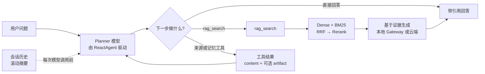

# 自动驾驶感知算法 LocalRAG

<p align="center">
  <a href="README.md">English</a> · <strong>简体中文</strong>
</p>

LocalRAG 是一个面向自动驾驶感知算法资料的 Agentic RAG 系统。它将混合检索、来源核验、任务记忆和可恢复研究流程组合在一个 Streamlit 应用中，并支持云端模型、本地模型服务和长会话压缩。

## 工作原理

一次问答由 `ReactAgent` 驱动 Planner 循环：运行时配置的聊天模型决定调用工具还是直接回答。`rag_search` 在工具内部完成检索和 RAG 生成，并以带引用答案作为本轮终止结果直接交付。来源与记忆工具才会把 `ToolMessage` 结果返回给 Planner，由 Planner 继续编排或整理最终回答。研究任务、会话摘要和任务记忆独立持久化，页面刷新后仍可继续。



## 快速开始

### 1. 准备 Windows 环境

本地流程使用 PowerShell、Python 3.11/3.12、NVIDIA GPU 和仓库根目录下的 `.venv`：

```powershell
.\quickstart\windows\01-check-environment.ps1 -InstallDependencies
```

从下载 Qwen3-4B、重建默认语料，到 203 条数据准备、4-bit QLoRA、模型导出、服务启动和评测，完整命令见 [Windows 本地运行指南](quickstart/windows/README.md)。

### 2. 配置三个模型角色

复制 `config/runtime_models.example.json` 为 `config/runtime_models.json`。运行时分别维护 `planner`、`rag` 和 `summary`，每个角色都有一组 cloud 配置、一组 local 配置，以及 `local` / `cloud` 二选一的 `route`。

```powershell
Copy-Item config/runtime_models.example.json config/runtime_models.json
[Environment]::SetEnvironmentVariable("LOCALRAG_CLOUD_API_KEY", "填入云端 API Key", "User")
[Environment]::SetEnvironmentVariable("LOCALRAG_MODEL_API_TOKEN", "填入本地服务 token", "User")
```

JSON 只保存环境变量名，不保存密钥。Planner 选择 `local` 时，本地 invocation 异常会转到该角色自己的 cloud 配置；RAG 和摘要经过 Gateway 的分类降级，流式请求只有在本地尚未输出内容时才允许切到云端。三个角色可以共用同一个 endpoint 和模型，也可以分别使用不同端口。共用服务不会串会话，因为每次请求都会携带完整消息；需要注意的是，它们会竞争同一个模型队列。

Streamlit 侧边栏只切换三个角色的 `route`，endpoint 和模型名仍在 JSON 中维护。切换结果会写回当前运行时文件；研究任务执行期间不允许切换。

#### 本地模型服务启动方法

Windows 标准路径可以直接启动仓库已评测的 E6.1 adapter，也可以启动按完整数据配置重新训练的 adapter：

```powershell
.\quickstart\windows\06-start-service.ps1 -Profile e6_1_adapter_bf16
# 或
.\quickstart\windows\06-start-service.ps1 -Profile full_sft_adapter_bf16
```

脚本会校验 adapter 和 manifest，把 local endpoint 的模型身份写入运行时 JSON，并监听 `127.0.0.1:8001`。模型下载、训练和评测命令见 [Windows 本地运行指南](quickstart/windows/README.md)。

下面保留 E6.1 发布 profile 的底层启动方法。该路径由模型后端（Transformers 或 `llama-server`）和 OpenAI-compatible wrapper 两层组成，示例使用 `127.0.0.1:8002`。模型权重、GGUF 文件和 `tools/llama.cpp` 二进制需要在本机准备：

| profile | 后端 | 启动前需要 | 适用场景 |
|---|---|---|---|
| `e6_1_adapter_bf16` | Transformers | `models/Qwen3-4B`、E6.1 LoRA adapter、`e6_1_input_manifest.json` | 复现已评测 adapter，显存占用较高 |
| `e6_1_q4_k_m` | `llama.cpp` | `artifacts/models/qwen3-4b.e6.1-q4_k_m.gguf`、对应 manifest、已安装的 `llama-server.exe` | Windows 本地发布候选 |

推荐在终端 A 直接使用仓库脚本。脚本会先校验 manifest，服务启动前执行 warmup 和 readiness 检查。

**Transformers BF16：**

```powershell
$env:LOCALRAG_MODEL_API_TOKEN = "your-local-service-token"
.\model_deployment\launch_transformers.ps1 -Port 8002
```

该脚本默认使用 `e6_1_adapter_bf16` 和 `config/model_serving_profiles.example.json`。如果需要自己维护 profile 文件，也可以直接运行：

```powershell
python -m model_serving.main `
  --profiles config/model_serving_profiles.json `
  --profile e6_1_adapter_bf16 `
  --host 127.0.0.1 `
  --port 8002 `
  --workers 1
```

**Q4_K_M：一键启动内部 llama.cpp 和 wrapper：**

```powershell
$env:LOCALRAG_MODEL_API_TOKEN = "your-local-service-token"
.\model_deployment\launch_llama.ps1 `
  -Mode ReleaseQ4 `
  -Model artifacts/models/qwen3-4b.e6.1-q4_k_m.gguf `
  -Manifest model_deployment/manifests/e6_1_q4_k_m_manifest.json `
  -InternalPort 18002 `
  -Port 8002
```

`launch_llama.ps1` 会在 `127.0.0.1:18002` 启动 `llama-server.exe`，等待 `/v1/models` 出现 `localrag-qwen3-4b-e6.1` 后，再在 `127.0.0.1:8002` 启动本项目 wrapper；llama.cpp 的 stdout/stderr 会写入 `results/model_serving/llama-cpp/`。脚本要求 manifest 中记录的 llama.cpp 版本已经安装到 `tools/llama.cpp/<version>/bin/llama-server.exe`。安装脚本需要官方地址和 SHA-256，参数说明见：

```powershell
Get-Help .\model_deployment\install_llama_cpp.ps1 -Full
```

如果要拆开启动、单独排查内部服务，可以先运行与脚本相同的 `llama-server` 参数，再在另一个终端启动 wrapper：

```powershell
$env:LLAMA_ARG_CHAT_TEMPLATE_KWARGS = '{"enable_thinking":false}'
& .\tools\llama.cpp\b10256\bin\llama-server.exe `
  --model .\artifacts\models\qwen3-4b.e6.1-q4_k_m.gguf `
  --alias localrag-qwen3-4b-e6.1 `
  --host 127.0.0.1 `
  --port 18002 `
  --ctx-size 40960 `
  --jinja `
  --parallel 1 `
  --n-gpu-layers 999 `
  --temp 0
```

```powershell
python -m model_serving.main `
  --profiles config/model_serving_profiles.json `
  --profile e6_1_q4_k_m `
  --host 127.0.0.1 `
  --port 8002 `
  --workers 1 `
  --llama-base-url http://127.0.0.1:18002/v1
```

服务启动后，在终端 B 检查状态：

```powershell
Invoke-RestMethod http://127.0.0.1:8002/health
Invoke-RestMethod `
  -Headers @{Authorization = "Bearer $env:LOCALRAG_MODEL_API_TOKEN"} `
  http://127.0.0.1:8002/ready
Invoke-RestMethod `
  -Headers @{Authorization = "Bearer $env:LOCALRAG_MODEL_API_TOKEN"} `
  http://127.0.0.1:8002/v1/models
```

三个接口依次回答“进程是否活着、模型是否 warmup 完成、服务暴露了哪个固定模型”。`/ready` 未通过时不要启动 UI；常见原因是权重路径、manifest 或内部 llama.cpp 地址不匹配。

然后把需要使用该服务的角色的 local endpoint 指向 8002，在终端 C 启动 UI：

```powershell
$env:LOCALRAG_CLOUD_API_KEY = [Environment]::GetEnvironmentVariable("LOCALRAG_CLOUD_API_KEY", "User")
$env:LOCALRAG_MODEL_API_TOKEN = [Environment]::GetEnvironmentVariable("LOCALRAG_MODEL_API_TOKEN", "User")
streamlit run app_qa.py --server.fileWatcherType none
```

三个角色分别设置 `route`。RAG 或摘要走本地时，Gateway 按错误类型和首 token 边界决定是否使用对应角色的云端 endpoint；Planner 的本地路径通过 OpenAI-compatible tool calling 接入 LangGraph，本地 invocation 异常时转到同角色云端模型。

### 3. 启动问答服务

```bash
streamlit run app_qa.py
```

默认读取 `config/active_corpus.json`。仓库已提交清洗后的 100 篇语料，Chroma 索引需要在本机执行 `quickstart/windows/03-prepare-data.ps1` 生成；已评测语料会产生 7339 个 chunk。active corpus profile 同时记录来源数、片段数和 corpus/registry 指纹。也可以通过环境变量选择已有目录：

```powershell
$env:LOCALRAG_PERSIST_DIRECTORY = "path\to\chroma_store"
streamlit run app_qa.py
```

UI 会检查 active corpus profile、最近一次 Agent Gate 的 corpus/代码身份和最近三轮评测的稳定性 Gate。任一身份不一致、artifact 损坏或出现递归上限错误时，Gate 均显示为未通过。

### 4. 上传文档入库

```bash
streamlit run app_file_uploader.py
```

上传入口采用显式发布的两阶段流程：上传后先做文本规范化、元数据生成和分块，结果写入 `results/ingestion_staging/` 并展示预览；点击“发布到正式知识库”后，才会写入 Chroma、`source_registry.json` 和 `config/active_corpus.json`。发布后的 BM25 是内存快照：如果问答服务在独立进程中运行，需要刷新/重建 `RagService` 才能检索到新文档。

评测是可选步骤。默认发布不调用评测；只有调用 `IngestionWorkflow.publish(..., evaluate=True, evaluator=...)` 并注入 evaluator callback 时才执行。即使跳过评测，发布仍会更新 active corpus profile；运行时 Gate 在没有匹配评测产物时会诚实地保持未通过。

## 项目结构

```
LocalRAG/
├── app_qa.py                  # 问答入口（Streamlit）
├── app_file_uploader.py       # 文件上传入库入口
├── agent/
│   ├── react_agent.py         # Session-aware Agent 入口
│   ├── observability.py       # 工具轨迹、来源、记忆与 gate 可观察性
│   ├── context/               # 上下文预算、摘要压缩、持久化与恢复
│   ├── memory/                # Agent 会话检索记忆与持久化任务记忆
│   ├── research/              # 研究 run、恢复控制、证据绑定与 UI 适配
│   └── tools/                 # RAG、来源研究与任务记忆工具
├── core/
│   ├── rag.py                 # RAG 服务核心
│   ├── knowledge_base.py      # 知识库入库与 chunk 写入
│   ├── ingestion_workflow.py  # staging、预览、显式发布与可选评测
│   ├── chunking.py            # 分块策略（baseline / doc_type_aware / semantic）
│   ├── bm25_retriever.py      # BM25 稀疏召回
│   ├── retrieval_pipeline.py  # Dense + BM25 → RRF → Reranker 主链路
│   ├── hybrid_retriever.py    # 历史加权 Hybrid 对照实现
│   └── reranker.py            # Cross-Encoder Reranker
├── config/
│   ├── runtime_models.json    # 运行时配置（不提交）
│   ├── runtime_keys.py        # 配置加载器
│   └── settings.py            # 全局设置
├── eval/                      # 评测脚本
│   └── release_gate.py        # 最近三轮正式 Agent Gate 稳定性检查
├── model_gateway/              # 本地模型 gateway、熔断、fallback 与适配器
├── model_serving/              # Transformers / llama.cpp 服务端与队列指标
├── model_deployment/           # 模型合并、量化、manifest 与启动脚本
├── data/
│   ├── evaluation/            # 清洗后的评测/训练数据集
│   └── sources/               # 知识源文档（100 篇：10 Apollo + 81 论文/报告 + 9 标准）
├── results/                   # 评测结果
├── scripts/                   # 工具脚本
├── test/                      # 单元测试与评测脚本
├── release_note.md            # v1.1–v1.7 与 main 累计发布记录
└── requirements.txt           # 应用与本地模型服务的统一依赖入口
```

## 评测

### 运行评测

```bash
# Baseline 评测（使用 chunking_eval 生成的当前 store）
python eval/eval_ragas.py \
  --dataset data/evaluation/gold/eval_set.json \
  --store-dir results/chunking_eval/stores/<run_id>/baseline \
  --predictions-out results/ragas_eval/eval_set-current/predictions.json \
  --metrics-out results/ragas_eval/eval_set-current/metrics.json

# 分块策略对比（baseline / doc_type_aware / semantic）
python eval/eval_chunking.py \
  --dataset data/evaluation/gold/eval_set.json

# 纯检索评测（以 semantic store 为例）
python eval/eval_retrieval_only.py \
  --dataset data/evaluation/gold/eval_set.json \
  --store-dir results/chunking_eval/stores/<run_id>/semantic

# Hybrid Retrieval 对比
python eval/eval_hybrid.py \
  --dataset data/evaluation/gold/eval_set.json \
  --store-dir results/chunking_eval/stores/<run_id>/semantic \
  --alpha 0.5

# Reranker 效果评估
python eval/eval_reranker.py \
  --dataset data/evaluation/gold/eval_set.json \
  --store-dir results/chunking_eval/stores/<run_id>/semantic \
  --alpha 0.5

# Formal Judge 流水线汇总
python eval/eval_judge_formal_run.py \
  --dataset data/evaluation/gold/eval_set.json

# Agent 正式 Gate（默认使用 active corpus）
python eval/eval_agent.py

# 检查最近三轮 Agent Gate 的稳定性
python eval/release_gate.py

# 本地模型服务质量与可靠性评测
python eval/eval_model_quality.py
python eval/eval_service_reliability.py

# 长会话压缩评测
python eval/eval_long_context.py
```

### 微调数据与行为评测

```bash
# 将 203 条训练样本导出为 Qwen/TRL 常用 chat JSONL
python scripts/prepare_sft_dataset.py \
  --input data/evaluation/train/train_set.json \
  --train-output data/finetuning/sft_train.jsonl \
  --validation-output data/finetuning/sft_validation.jsonl \
  --validation-count 20

# 对 baseline / 微调后 predictions 做离线行为对比
python eval/eval_finetune_behavior.py \
  --baseline-predictions results/baseline_eval/<run_id>/predictions.json \
  --predictions results/finetuned_eval/<run_id>/predictions.json
```

### 检索评测结果与口径（100 题，BGE-M3，100 篇文档）

下表是 v1.2/v1.3 的分块与 Cross-Encoder 消融结果，使用历史 semantic/doc-type-aware 检索评测入口；它用于比较分块和精排收益，不等同于 v1.7 的在线默认主链路。

| 分块策略 | Reranker | Hit@5 | MRR | Hit@1 | Hit@3 |
|---------|:--------:|:-----:|:---:|:-----:|:-----:|
| baseline | No | 0.920 | 0.874 | 0.840 | 0.910 |
| baseline | Yes | 0.930 | 0.889 | 0.860 | 0.920 |
| doc_type_aware | No | 0.930 | 0.870 | 0.830 | 0.920 |
| **doc_type_aware** | **Yes** | **0.940** | 0.892 | 0.850 | **0.940** |
| semantic | No | 0.930 | 0.798 | 0.710 | 0.870 |
| **semantic** | **Yes** | **0.940** | **0.893** | **0.860** | 0.930 |

该组实验中，doc_type_aware + reranker 与 semantic + reranker 的 Hit@5 均为 0.94；semantic + reranker 的 MRR 最高，为 0.893。

Reranker 的收益主要体现在排序质量：semantic 的 MRR 从 0.798 提升到 0.893，Hit@1 从 0.71 提升到 0.86。v1.7 默认链路固定为 Dense + BM25 → RRF → Cross-Encoder → Top5；加权融合 `HybridRetriever` 作为历史对照保留，失败时降级到 Dense + reranker、Dense-only。

v1.7 最终默认链路在同一 100 题活动评测集、当前 doc-type-aware 活动语料上完成 retrieval-only 回归：Dense Top20 + BM25 Top20 → RRF → Cross-Encoder → Top5，Hit@1=0.85、Hit@3=0.97、Hit@5=0.97、MRR=0.9067，100/100 进入 `rrf_rerank` 且无 fallback；该结果不调用生成模型。由于分块索引、融合方法和评测入口同时发生变化，不能将 0.94→0.97 归因于 RRF 单项收益。

RAGAS 端到端对照中，hybrid + reranker 的 Context Precision/Recall 为 0.847/0.937；该指标评估生成上下文质量，与 retrieval-only 的 Hit@k/MRR 分属不同评测层。

### 微调、模型服务与长上下文

- 基于 LLaMA-Factory 对 Qwen3-4B 开展 4-bit QLoRA 微调，完成 LoRA 权重合并、Transformers 与 llama.cpp 双路径推理验证，并通过生成行为评测和训练退出检查确认微调目标。
- 基于 FastAPI 搭建 OpenAI-compatible 流式推理服务，支持请求排队、超时取消、API 鉴权和 Prometheus 指标；完成 BF16、GGUF F16 与 Q4_K_M 部署 profile 验证。
- 引入结构化滚动摘要和摘要 revision，长会话评测中的上下文 Token 中位数降低 73.5%。

Baseline 端到端评测使用当前 baseline store（`results/chunking_eval/stores/eval_set-20260522-071034/baseline`）重跑后，`answered_ratio=1.00`、`context_hit_ratio=1.00`、`evidence_source_hit_ratio=0.97`。

v1.6 本地模型服务与长会话验证：模型服务质量 gate、性能 benchmark、Task 8 UI 端到端验证和 Task 9 双轮压缩探针均通过；Task 9 的摘要 revision 从 `1` 正确递增到 `2`。

## 版本

| 版本 | 核心能力 |
|------|---------|
| v1.0 | Gold Set、baseline runner 和 judge 骨架 |
| v1.1 | 文档采集、chunk metadata 和 formal judge |
| v1.2 | Hybrid retrieval、reranker 和 semantic chunking |
| v1.3 | 100 篇语料、100 题评测集、Qwen3-4B 微调实验 |
| v1.4.2 | 会话记忆、任务记忆、来源工具和 Agent Gate |
| v1.5 | 执行预算、证据绑定、暂停恢复和 checkpoint |
| v1.6 | 本地模型服务、Gateway fallback 和会话压缩 |
| v1.7 | Dense + BM25 → RRF → Cross-Encoder、统一 provenance 和工具错误合同 |
| main | 文档上传 staging、预览、显式 publish 和可选评测回调 |
